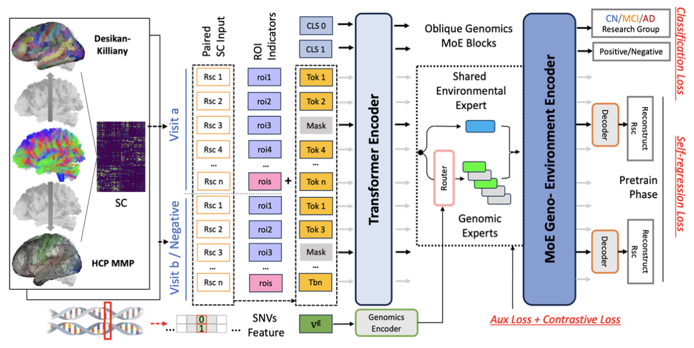

# 🧠 OG-MoE: [Oblique Genomics Mixture of Experts: Prediction of Brain Disorder With Aging-Related Changes of Brain’s Structural Connectivity Under Genomic Influences]

[](LICENSE)
[](https://www.python.org/)

---

## 📄 Description

This repository contains the official codebase for the paper:

**"[Oblique Genomics Mixture of Experts: Prediction of Brain Disorder With Aging-Related Changes of Brain’s Structural Connectivity Under Genomic Influences]"**,  

Provisionally accepted for presentation at MICCAI 2025.

By Yanjun Lyu, Jing Zhang, Lu Zhang, Wei Ruan, Tianming Liu, and Dajiang Zhu.

Institute: 

Department of Computer Science and Engineering, University of Texas at Arlington. Department of Computer Science, Indiana University Indianapolis. School of Computing, University of Georgia.

Notice:

* This codebase will be continuing updated. Model checkpoint weights are releasing on September.

* Please acquired the DATA from ADNI dataset (adni.loni.usc.edu), following ADNI data agreement.

---

## 📜 Abstract

> [During the process of brain aging, the changes of white matter structural connectivity are closely correlated with the cognitive traits and brain function. Genes have strong controls over this transition of structural connectivity-altering, which influences brain health and may lead to severe dementia disease, e.g., Alzheimer’s disease. In this work, we introduce a novel deep-learning diagram, an oblique genomics mixture of experts(OG-MoE), designed to address the prediction of brain disease diagnosis, with awareness of the structural connectivity changes over time, and coupled with the genomics influences. By integrating genomics features into the dynamic gating router system of MoE layers, the model specializes in representing the structural connectivity components in separate parameter spaces. We pretrained the model on the self-regression task of brain connectivity predictions and then implemented multi-task supervised learning on brain disorder predictions and brain aging prediction. Compared to traditional associations analysis, this work provided a new way of discovering the soft but intricate inter-play between brain connectome phenotypes and genomic traits. It revealed the significant divergence of this correlation between the normal brain aging process and neurodegeneration.]

---

## 🖼️ Main Figures

### Figure 1: [Model overview]


---

## 🚀 Quick Start

### 1. Minial requirements

```Env
python 3.9 +
numpy
pickle5
torch
transformers
scikit-learn
```


### 2. Clone the repository

```bash
git clone https://github.com/autumnbreed/OG-MoE/
cd OG-MoE

# Prepare dataset as formats in Dataloader
# Modify ./config.json

python ./main_run.py ./config.json

```
